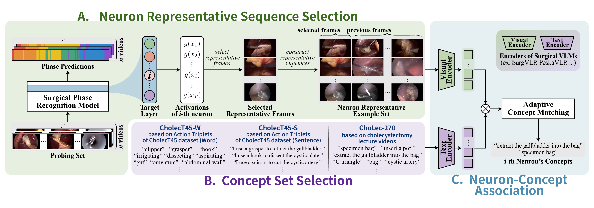
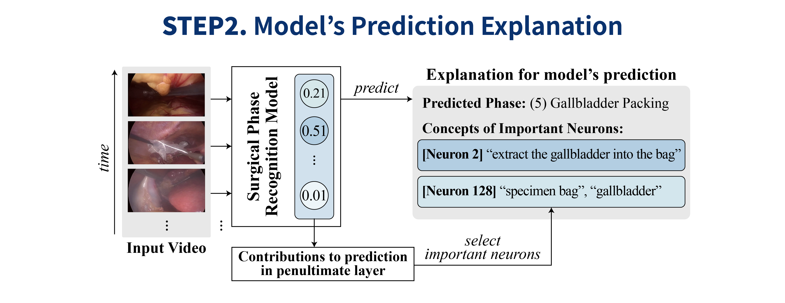

<!-- Hero Illustration + 링크 버튼 -->
<section class="section pt-4 pb-3">
  

    

      

        <!-- 첫 이미지에 figure-hero 클래스 추가 -->
        

          
        

      

    

    

      

        

          
          <a href="{{ page.paper_url }}" target="_blank" rel="noopener"
             class="button is-dark is-rounded is-medium">
            <i class="fas fa-file-pdf"></i>Paper
          </a>
          
          <a href="./static/pdf/SurgX_Poster.pdf" target="_blank" rel="noopener"
             class="button is-dark is-rounded is-medium">
            <i class="fas fa-file-pdf"></i>Poster
          </a>
          
          <a href="{{ page.code_url }}" target="_blank" rel="noopener"
             class="button is-link is-rounded is-medium">
            <i class="fab fa-github"></i>Code
          </a>
          
          <!-- 
          <a href="https://ailab-kyunghee.github.io/SSG-Com/"
            class="button is-link is-rounded is-medium">
            <i class="fas fa-database" aria-hidden="true"></i>
            Dataset (Coming Sep 23)
          </a>
           -->
        

      

    

  

</section>

<!-- Abstract -->
<section class="section pt-4 pb-4">
  

    

      

        <h3 class="h-subtitle">Abstract</h3>
        

        Surgical phase recognition plays a crucial role in surgical workflow analysis, enabling applications such as monitoring, skill assessment, and workflow optimization. However, deep learning models remain black-boxes, limiting interpretability and trust. 
        <b>SurgX</b> is a novel concept-based explanation framework that associates neurons with human-interpretable surgical concepts. We construct concept sets tailored to cholecystectomy, select representative neuron activation sequences, and annotate neurons with concepts. 
        By evaluating on TeCNO and Causal ASFormer using Cholec80, we demonstrate that SurgX provides meaningful explanations and improves transparency in surgical AI.  
        

      

    

  

</section>

---

<!-- Main Contributions -->
<section class="section pt-5 pb-5">
  

    

      

        <h1 class="h-title">Main Contributions</h1>
        <ul class="content has-text-left mt-4" style="display:inline-block; text-align:left;">
          <li>Proposed <strong>SurgX</strong>, the first concept-based explanation framework for surgical phase recognition.</li>
          <li>Developed specialized concept sets for cholecystectomy videos and analyzed best practices for concept selection.</li>
          <li>Validated SurgX on two models(Causal ASFormer, TeCNO), demonstrating meaningful concept–neuron associations that enhance interpretability.</li>
        </ul>
      

    

    

      

        <h2 class="h-title">SurgX, A Framework to Explain Surgical Phase Recognition Model</h2>
        

          
        

        

          <h3 class="h-subtitle" style="color:#3B6B1C;">A. Neuron Representative Sequence Selection</h3>
        

        

          <h3 class="h-subtitle" style="color:#3B6B1C;">B. Concept Set Selection</h3>
        

        

          <h3 class="h-subtitle" style="color:#3B6B1C;">C. Neuron-Concept Association</h3>
        

        

          
        

        

          
Details about concept set 1, 2, and 3 go here.

        

      

    

    

      

        <h2 class="h-title">Concept Set Construction</h2>
        

          
        

        

          
Details about concept set 1, 2, and 3 go here.

        

      

    

  

</section>

<!-- Dataset Comparison -->
<section class="section pt-4 pb-5">
  

    

      

        <h3 class="h-subtitle">Dataset Comparison</h3>
      

    

    

      

        

          
        

        

          
This table contrasts the datasets used in previous surgical scene graph studies with Endoscapes-SG201.

          <ul>
            <li>Endoscapes-SG201 is designed with holistic scene graph research in mind.</li>
            <li>It incorporates:
              <ul>
                <li>Diverse tools and anatomical structures as graph nodes.</li>
                <li>Diverse relationships as graph edges.</li>
                <li>Hand Identity labels as attributes of the tool nodes.</li>
              </ul>
            </li>
            <li>By unifying these elements, the dataset provides a more expressive and comprehensive foundation for modeling surgical scenes.</li>
          </ul>
        

      

    

  

</section>

<!-- Endoscapes-SG201 Details -->
<section class="section pt-4 pb-5">
  

    

      

        <h3 class="h-subtitle">Endoscapes-SG201 Details</h3>
      

    

    

      

        

          
        

        

          
This table presents the category-wise distribution of the additional labels introduced in Endoscapes-SG201.

          
<b>Additional Annotations:</b>

          <ul>
            <li><b>6 Surgical Instruments</b>: Hook (HK), Grasper (GP), Clipper (CL), Bipolar (BP), Irrigator (IG), Scissors (SC)</li>
            <li><b>6 Surgical Actions</b>: Dissect (Dis.), Retract (Ret.), Grasp (Gr.), Clip (Cl.), Coagulate (Co.), Null</li>
            <li><b>3 Hand Identities</b>: Operator’s Right Hand (Rt), Operator’s Left Hand (Lt), Assistant’s Hand (Assi)</li>
          </ul>
        

      

    

  

</section>

<!-- SSG-Com -->
<section class="section pt-5 pb-5">
  

    

      

        <h2 class="h-title">SSG-Com</h2>
      

    

    

      

        

          
        

      

    

    

      

        

          
<b>SSG-Com</b> is designed to leverage the diverse labels of Endoscapes-SG201.

          <ol>
            <li>
              <b>Graph Construction</b> 
              <b>Nodes</b>: Surgical instruments (with Hand identity), Anatomical structures 
              <b>Edges</b>: Spatial relations, Surgical action relations
            </li>
            <li class="mt-3">
              <b>Multi-task Training (3 classifiers)</b> 
              <b>Classifier 1</b>: Spatial relation classification 
              <b>Classifier 2</b>: Action relation classification 
              <b>Classifier 3</b>: Hand identity classification
              

                <b>Total Loss</b>:
                  \[
                  L_{\text{total}} = L_{\text{LG}} + \lambda_{\text{action}} L_{\text{action}} + \lambda_{\text{hand}} L_{\text{hand}} \tag*{}
                  \]
              

            </li>
          </ol>
        

      

    

  

</section>

---

<!-- Experimental Results -->
<section class="section pt-5 pb-4">
  

    

      

        <h1 class="h-title">Experimental Results</h1>
      

    

    

      

        

          
The latent graph of SSG-Com demonstrated its effectiveness across two downstream tasks.

          <ul>
            <li>Action Triplet Recognition</li>
            <li>CVS prediction</li>
          </ul>
        

      

    

    

      

        <h2 class="h-subtitle">Quantitative Results</h2>
        

          
        

        

          
<b>In Action Triplet Recognition (a):</b>

          <ul>
            <li>Modeling action relations as graph edges between nodes improved performance from 18.0 mAP (LG-CVS) to 23.5.</li>
            <li>Further incorporating Hand Identity increased performance to 24.2.</li>
          </ul>
          
<b>In CVS Prediction (b):</b>

          <ul>
            <li>Using Endoscapes-SG201 improved the performance of LG-CVS by 0.9 mAP, and SSG-Com achieved the highest score of 64.6.</li>
          </ul>
        

      

    

    

      

        <h2 class="h-subtitle">Qualitative Results</h2>
        

          
        

        

          By employing Endoscapes-SG201 and SSG-Com, we demonstrate the ability to construct a richer holistic surgical scene graph compared to existing approaches.
        

      

    

  

</section>

<!-- Collaborations -->
<section class="section pt-5 pb-6">
  

    

      

        

          
        

        

          

            The authors thank Ms. Haeun Kim, M.F.A., for her professional assistance with the illustrations in this work.
          

        

      

    

  

</section>