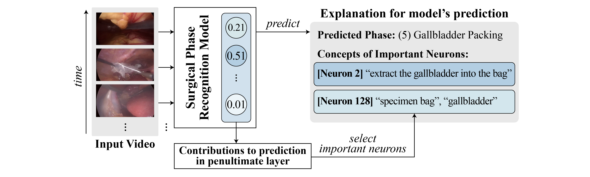

<!-- Hero Illustration + 링크 버튼 (그대로 유지) -->
<section class="section pt-4 pb-3 hero-section">
  

    

      

        

          
        

      

    

    

      

        

          
          <a href="{{ page.paper_url }}" target="_blank" rel="noopener"
             class="button is-dark is-rounded is-medium">
            <i class="fas fa-file-pdf"></i>Paper
          </a>
          
          <a href="./static/pdf/SurgX_Poster.pdf" target="_blank" rel="noopener"
             class="button is-dark is-rounded is-medium">
            <i class="fas fa-file-pdf"></i>Poster
          </a>
          
          <a href="{{ page.code_url }}" target="_blank" rel="noopener"
             class="button is-link is-rounded is-medium">
            <i class="fab fa-github"></i>Code
          </a>
          
        

      

    

  

</section>

<!-- Abstract (그대로 유지) -->
<section class="section pt-4 pb-4 abstract-section">
  

    

      

        <h3 class="h-subtitle">Abstract</h3>
        

          Surgical phase recognition is central to workflow analysis, enabling applications such as monitoring, skill assessment, and process optimization. However, the underlying deep models are often black boxes, limiting interpretability and trust.
          <b>SurgX</b> is a concept-driven explanation framework that associates neurons with human-interpretable surgical concepts. We construct cholecystectomy-specific concept sets, identify representative neuron activation sequences, and annotate neurons with concepts.
          Evaluated on TeCNO and Causal ASFormer using Cholec80, SurgX yields meaningful explanations and improves transparency in surgical AI.
        

      

    

  

</section>

<!-- Main Contributions (여기부터 시원한 간격 적용) -->
<section class="section pt-5 pb-5">
  

    

      

        <h1 class="h-title">Main Contributions</h1>
        <ul class="content mt-4">
          <li>Introduce <strong>SurgX</strong>, a concept-based explanation framework for surgical phase recognition.</li>
          <li>Develop cholecystectomy-tailored concept sets and analyze best practices for concept selection.</li>
          <li>Validate SurgX on Causal ASFormer and TeCNO, showing consistent concept–neuron associations that enhance interpretability.</li>
        </ul>
      

    

    

    

      

        <h1 class="h-title step-title">SurgX STEP 1. Neuron–Concept Annotation</h1>

        

          
        

        

          The pipeline for annotating concepts to neurons proceeds in three stages:
          <ol>
            <strong>A. Neuron Representative Sequence Selection</strong> – Select representative activation sequences for each neuron.
             
            <strong>B. Concept Set Selection</strong> – Choose among three concept sets; <em>ChoLec-270</em> performs best in our study.
             
            <strong>C. Neuron–Concept Association</strong> – Match neuron sequences with concepts via similarity in a surgical VLM space.
          </ol>
          Details of each stage are provided below.
        

        

          <h3 class="h-subtitle" style="color:#3B6B1C;">A. Neuron Representative Sequence Selection</h3>
        

        

          
        

        

          Given a trained temporal phase recognizer (e.g., Causal ASFormer or TeCNO), we first select frames that yield high activations in the penultimate layer. Because temporal models respond to sequences rather than single frames, we extend each selected frame with its preceding frames to form a representative sequence. Ablation studies are summarized below.
        

        

          <h4 class="h-minor" style="color:#3B6B1C;">Ablation Study: Frame Selection</h4>
        

        

          
        

        

          <h4 class="h-minor" style="color:#3B6B1C;">Ablation Study: Sequence Length</h4>
        

        

          
        

        

          <h3 class="h-subtitle" style="color:#5F2A96;">B. Concept Set Selection</h3>
        

        

          
        

        

          Appropriate concept coverage is critical: if a neuron’s behavior is not representable by the concept set, reliable annotation is impossible. We therefore construct three cholecystectomy-related concept sets and compare them empirically.
        

        

          <h4 class="h-minor" style="color:#5F2A96;">Ablation Study: Concept Sets</h4>
        

        

          
        

        

          <h3 class="h-subtitle" style="color:#4B8BAF;">C. Neuron–Concept Association</h3>
        

        

          
        

        

          Using the selected sequences and concept set, we compute cosine similarity in a surgical VLM space (e.g., SurgVLP, PeskaVLP) between each neuron’s representative sequence and each concept text, and assign to each neuron the concepts with highest similarity.
        

      

    

    
    

    

      

        <h1 class="h-title step-title">SurgX STEP 2. Model's Prediction Explanation</h1>

        

          
        

        

          The pipeline for annotating concepts to neurons proceeds in three stages:
          <ol>
            <li><strong>A. Neuron Representative Sequence Selection</strong> – Select representative activation sequences for each neuron.</li>
            <li><strong>B. Concept Set Selection</strong> – Choose among three concept sets; <em>ChoLec-270</em> performs best in our study.</li>
            <li><strong>C. Neuron–Concept Association</strong> – Match neuron sequences with concepts via similarity in a surgical VLM space.</li>
          </ol>
          Details of each stage are provided below.
        

        

          <h4 class="h-subtitle">Qualitative Results – Explanation Examples</h4>
          <!-- === Video Player Block === -->

  <!-- Video picker toolbar -->
  

    <button class="button is-link is-light is-rounded is-small surgx-pick" data-name="video41">video41</button>
    <button class="button is-link is-light is-rounded is-small surgx-pick" data-name="video42">video42</button>
    <button class="button is-link is-light is-rounded is-small surgx-pick" data-name="video43">video43</button>
    <button class="button is-link is-light is-rounded is-small surgx-pick" data-name="video44">video44</button>
    <button class="button is-link is-light is-rounded is-small surgx-pick" data-name="video45">video45</button>
  

  <!-- Video element -->
  

    <video
      id="surgx-mp4"
      src="./static/video/video41.mp4"
      playsinline
      muted
      preload="metadata"
      style="max-width:100%; height:auto; background:#000;"
    ></video>
  

  <!-- Controls -->
  

    <button id="surgx-mp4-toggle" class="button is-dark is-rounded is-small">
      <i class="fas fa-pause"></i>
      Pause
    </button>

    <input id="surgx-mp4-progress" type="range" min="1" max="1" value="1" step="1" style="flex:1;" />
    
      1/1
    
  

  <!-- Time display -->
  

    0:00 / 0:00
  

        

      

    

  

</section>

